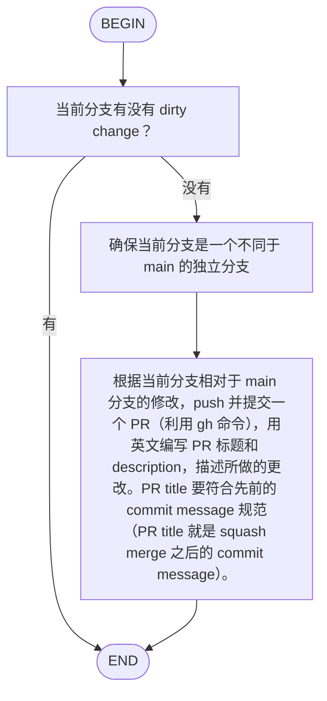

```mermaid
flowchart TB
    A(["BEGIN"]) --> B["当前分支有没有 dirty change？"]
    B -- 有 --> D(["END"])
    B -- 没有 --> n1["确保当前分支是一个不同于 main 的独立分支"]
    n1 --> n2["根据当前分支相对于 main 分支的修改，push 并提交一个 PR（利用 gh 命令），用英文编写 PR 标题和 description，描述所做的更改。PR title 要符合先前的 commit message 规范（PR title 就是 squash merge 之后的 commit message）。"]
    n2 --> D
```
