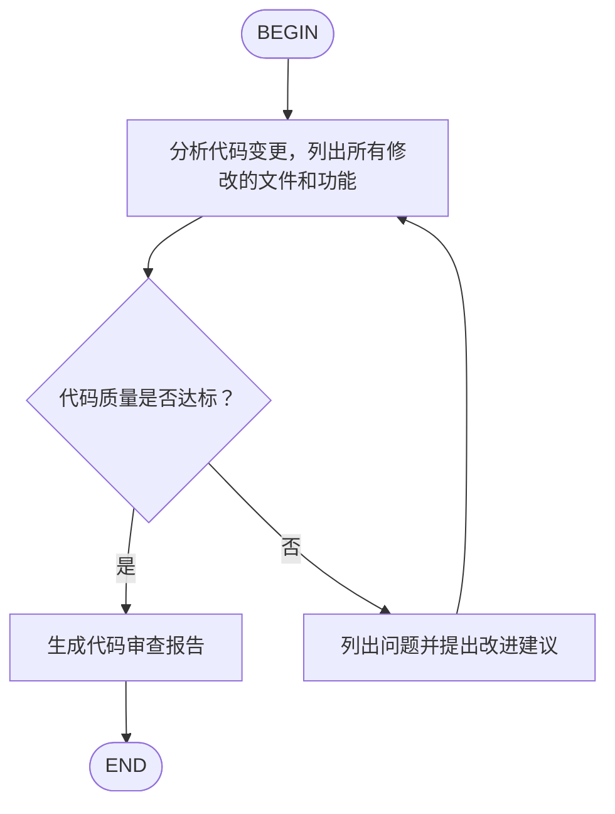

# Agent Skills

[Agent Skills](https://agentskills.io/) 是一个开放格式，用于为 AI Agent 添加专业知识和工作流程。Kimi Code CLI 支持加载 Agent Skills，扩展 AI 的能力。

## Agent Skills 是什么

一个 Skill 就是一个包含 `SKILL.md` 文件的目录。Kimi Code CLI 启动时会发现所有 Skills，并将它们的名称、路径和描述注入到系统提示词中。AI 会根据当前任务的需要，自行决定是否读取具体的 `SKILL.md` 文件来获取详细指引。

例如，你可以创建一个「代码风格」Skill，告诉 AI 你项目的命名规范、注释风格等；或者创建一个「安全审计」Skill，让 AI 在审查代码时关注特定的安全问题。

## Skill 发现

Kimi Code CLI 采用分层加载机制发现 Skills，按以下优先级加载（后加载的会覆盖同名 Skill）：

**内置 Skills**

随软件包安装的 Skills，提供基础能力。

**用户级 Skills**

存放在用户主目录中，在所有项目中生效。Kimi Code CLI 会按优先级检查以下目录，使用第一个存在的目录：

1. `~/.config/agents/skills/`（推荐）
2. `~/.agents/skills/`
3. `~/.kimi/skills/`
4. `~/.claude/skills/`
5. `~/.codex/skills/`

**项目级 Skills**

存放在项目目录中，仅在该项目工作目录下生效。Kimi Code CLI 会按优先级检查以下目录，使用第一个存在的目录：

1. `.agents/skills/`（推荐）
2. `.kimi/skills/`
3. `.claude/skills/`
4. `.codex/skills/`

你也可以通过 `--skills-dir` 参数指定其他目录，此时会跳过用户级和项目级 Skills 的发现：

```sh
kimi --skills-dir /path/to/my-skills
```

## 内置 Skills

Kimi Code CLI 内置了以下 Skills：

- **kimi-cli-help**：Kimi Code CLI 帮助。解答关于 Kimi Code CLI 安装、配置、斜杠命令、键盘快捷键、MCP 集成、供应商、环境变量等问题。
- **skill-creator**：Skill 创建指南。当你需要创建新的 Skill（或更新现有 Skill）来扩展 Kimi 的能力时，可以使用此 Skill 获取详细的创建指导和最佳实践。

## 创建 Skill

创建一个 Skill 只需要两步：

1. 在 skills 目录下创建一个子目录
2. 在子目录中创建 `SKILL.md` 文件

**目录结构**

一个 Skill 目录至少需要包含 `SKILL.md` 文件，也可以包含辅助目录来组织更复杂的内容：

```
~/.config/agents/skills/
└── my-skill/
    ├── SKILL.md          # 必需：主文件
    ├── scripts/          # 可选：脚本文件
    ├── references/       # 可选：参考文档
    └── assets/           # 可选：其他资源
```

**`SKILL.md` 格式**

`SKILL.md` 使用 YAML Frontmatter 定义元数据，后面是 Markdown 格式的提示词内容：

```markdown
---
name: code-style
description: 我的项目代码风格规范
---

## 代码风格

在这个项目中，请遵循以下规范：

- 使用 4 空格缩进
- 变量名使用 camelCase
- 函数名使用 snake_case
- 每个函数都需要 docstring
- 单行不超过 100 字符
```

**Frontmatter 字段**

| 字段 | 说明 | 是否必填 |
|------|------|----------|
| `name` | Skill 名称，1-64 字符，只能使用小写字母、数字和连字符；省略时默认使用目录名 | 否 |
| `description` | Skill 描述，1-1024 字符，说明 Skill 的用途和使用场景；省略时显示 "No description provided." | 否 |
| `license` | 许可证名称或文件引用 | 否 |
| `compatibility` | 环境要求说明，最多 500 字符 | 否 |
| `metadata` | 额外的键值对属性 | 否 |

**最佳实践**

- 保持 `SKILL.md` 在 500 行以内，将详细内容移到 `scripts/`、`references/` 或 `assets/` 目录
- 在 `SKILL.md` 中使用相对路径引用其他文件
- 提供清晰的步骤指引、输入输出示例和边界情况说明

## 示例 Skill

**PPT 制作**

```markdown
---
name: pptx
description: 创建和编辑 PowerPoint 演示文稿
---

## PPT 制作流程

创建演示文稿时，遵循以下步骤：

1. 分析内容结构，规划幻灯片大纲
2. 选择合适的配色方案和字体
3. 使用 python-pptx 库生成 .pptx 文件

## 设计原则

- 每页幻灯片聚焦一个主题
- 文字简洁，使用要点而非长段落
- 保持视觉层次清晰，标题、正文、注释有明确区分
- 配色统一，避免超过 3 种主色
```

**Python 项目规范**

```markdown
---
name: python-project
description: Python 项目开发规范，包括代码风格、测试和依赖管理
---

## Python 开发规范

- 使用 Python 3.14+
- 使用 ruff 进行代码格式化和 lint
- 使用 pyright 进行类型检查
- 测试使用 pytest
- 依赖管理使用 uv

代码风格：
- 行长度限制 100 字符
- 使用类型注解
- 公开函数需要 docstring
```

**Git 提交规范**

```markdown
---
name: git-commits
description: Git 提交信息规范，使用 Conventional Commits 格式
---

## Git 提交规范

使用 Conventional Commits 格式：

类型(范围): 描述

允许的类型：feat, fix, docs, style, refactor, test, chore

示例：
- feat(auth): 添加 OAuth 登录支持
- fix(api): 修复用户查询返回空值的问题
- docs(readme): 更新安装说明
```

## 使用斜杠命令加载 Skill

`/skill:<name>` 斜杠命令让你可以将常用的提示词模板保存为 Skill，需要时快速调用。输入命令后，Kimi Code CLI 会读取对应的 `SKILL.md` 文件内容，并将其作为提示词发送给 Agent。

例如：

- `/skill:code-style`：加载代码风格规范
- `/skill:pptx`：加载 PPT 制作流程
- `/skill:git-commits 修复用户登录问题`：加载 Git 提交规范，同时附带额外的任务描述

斜杠命令后面可以附带额外的文本，这些内容会追加到 Skill 提示词之后，作为用户的具体请求。

::: tip 提示
如果只是普通对话，Agent 会根据上下文自动判断是否需要读取 Skill 内容，不需要手动调用。
:::

Skills 让你可以将团队的最佳实践和项目规范固化下来，确保 AI 始终遵循一致的标准。

## Flow Skills

Flow Skill 是一种特殊的 Skill 类型，它在 `SKILL.md` 中内嵌 Agent Flow 流程图，用于定义多步骤的自动化工作流。与普通 Skill 不同，Flow Skill 通过 `/flow:<name>` 命令调用，会按照流程图自动执行多个对话轮次。

**创建 Flow Skill**

创建 Flow Skill 需要在 Frontmatter 中设置 `type: flow`，并在内容中包含 Mermaid 或 D2 格式的流程图代码块：

````markdown
---
name: code-review
description: 代码审查工作流
type: flow
---


````

**流程图格式**

支持 Mermaid 和 D2 两种格式：

- **Mermaid**：使用 ` ```mermaid ` 代码块，[Mermaid Playground](https://www.mermaidchart.com/play) 可用于编辑和预览
- **D2**：使用 ` ```d2 ` 代码块，[D2 Playground](https://play.d2lang.com) 可用于编辑和预览

流程图必须包含一个 `BEGIN` 节点和一个 `END` 节点。普通节点的文本作为提示词发送给 Agent；分支节点需要 Agent 在输出中使用 `<choice>分支名</choice>` 选择下一步。

**D2 格式示例**

```
BEGIN -> B -> C
B: 分析现有代码，为 XXX 功能编写设计文档
C: Review 设计文档是否足够详细
C -> B: 否
C -> D: 是
D: 开始实现
D -> END
```

对于多行标签，可以使用 D2 的块字符串语法（`|md`）：

```
BEGIN -> step -> END
step: |md
  # 详细指引

  1. 分析代码结构
  2. 检查潜在问题
  3. 生成报告
|
```

**执行 Flow Skill**

Flow Skill 可以通过两种方式调用：

- `/flow:<name>`：执行流程，Agent 会从 `BEGIN` 节点开始，按照流程图定义依次处理每个节点，直到到达 `END` 节点
- `/skill:<name>`：与普通 Skill 一样，将 `SKILL.md` 内容作为提示词发送给 Agent（不自动执行流程）

```sh
# 执行流程
/flow:code-review

# 作为普通 Skill 加载
/skill:code-review
```
